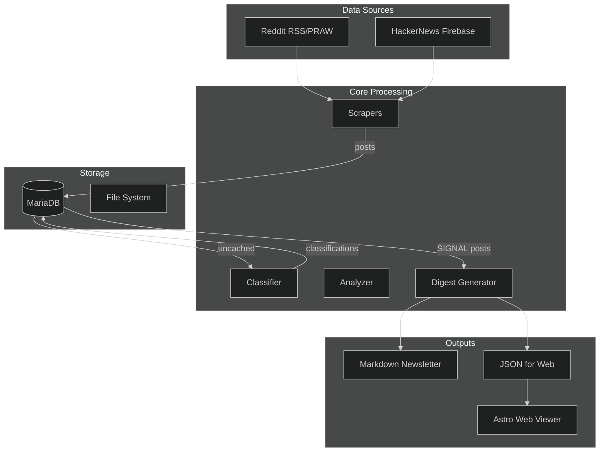
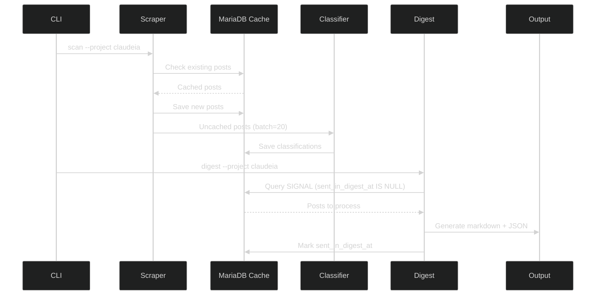
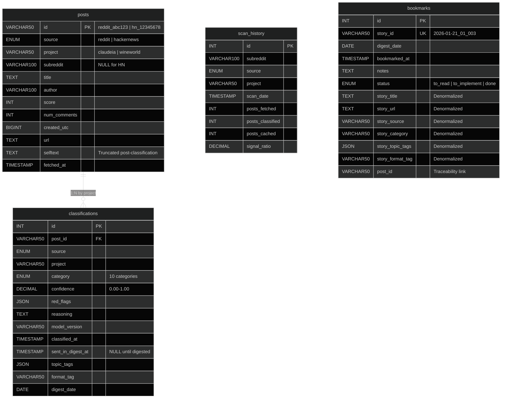

# ClaudeRedditor - Architecture

> Technical document explaining the "why" behind architectural decisions.

---

## System Overview



---

## Data Flow Detail



---

## Database Schema



---

## Key Design Decisions

### 1. Multi-Project Architecture

```
projects/
├── claudeia/
│   ├── config.yaml       # topic, subreddits, hn_keywords
│   └── prompts/
│       ├── classify.md   # Classification prompt
│       └── digest.md     # Newsletter prompt
└── wineworld/
    ├── config.yaml
    └── prompts/
```

**Decision**: Each project is a self-contained directory with configuration and prompts.

**Why**:
- Zero code changes to add new project
- Different topics need different classification criteria
- Prompts can be tuned per-project without affecting others

**Trade-off**: More files to maintain, but better isolation.

**Alternative rejected**: Centralized config in `.env` or database (inflexible, hard to version).

---

### 2. Classification Categories (10 total)

| Group | Categories | Purpose |
|-------|------------|---------|
| **SIGNAL** | technical, troubleshooting, research_verified | Content worth digesting |
| **NOISE** | mystical, unverified_claim, engagement_bait | Content to filter out |
| **META** | community, meme | Community content (not noise, not signal) |
| **OTHER** | outlier | Doesn't fit categories |
| **UNRELATED** | unrelated | Outside project scope |

**Decision**: 10 granular categories instead of simple SIGNAL/NOISE binary.

**Why**:
- Enables fine-grained metrics (what TYPE of noise?)
- Different filtering rules (META might be interesting, NOISE never is)
- Signal ratio excludes UNRELATED (not noise, just off-topic)

**Trade-off**: More complex prompts and logic.

---

### 3. Post-Classification Truncation

```python
# In analyzer.py after classification
if CategoryEnum.is_low_value(category):  # NOISE or UNRELATED
    post['selftext'] = post['selftext'][:500]
else:  # SIGNAL or META
    post['selftext'] = post['selftext'][:5000]
```

**Decision**: Truncate selftext AFTER classification, based on category.

**Why**:
- Classification needs full context to detect red flags
- NOISE posts don't deserve full storage
- SIGNAL posts might need content for digest

**Trade-off**: Slightly more complex save logic.

**Alternative rejected**: Truncate before classification (loses accuracy).

---

### 4. Same Post, Different Classifications

**Decision**: UNIQUE constraint on (post_id, project), not just post_id.

**Why**: A post about "AI in wine industry" could be:
- `technical` in project "wineworld"
- `unrelated` in project "claudeia"

Classification depends on project context.

**Trade-off**: More classifications stored, but accurate per-project filtering.

---

### 5. Denormalized Bookmarks

```python
class Bookmark(Base):
    story_id = ...           # "2026-01-21_01_003"
    story_title = ...        # Copied at bookmark time
    story_url = ...          # Copied at bookmark time
    story_category = ...     # Copied at bookmark time
    post_id = ...            # Link to original (for queries)
```

**Decision**: Copy story data at bookmark time, don't rely on JOINs.

**Why**:
- Bookmark is a "snapshot" of the story as user saw it
- Digest JSON might be regenerated with different story IDs
- Avoids complex JOINs for simple bookmark listing

**Trade-off**: Data duplication, but simpler queries.

---

### 6. RSS as Default for Reddit

**Decision**: Use RSS feed by default, PRAW only if credentials provided.

**Why**:
- RSS works without API key (zero setup)
- Sufficient for 50-100 posts per scan
- Lower barrier to entry

**Trade-off**: Less volume than PRAW, no real-time capabilities.

---

### 7. Dual Output Format (Markdown + JSON)

```
outputs/
├── digests/
│   └── digest_2026-01-24_01.md    # Human-readable newsletter
└── web/
    ├── claudeia_2026-01-24_01.json # Machine-readable
    └── latest.json -> claudeia_2026-01-24_01.json
```

**Decision**: Generate both formats by default (`--format both`).

**Why**:
- Markdown for email/reading
- JSON for web viewer (Astro)
- Same data, different consumers

**Trade-off**: Two files per digest, but serves different use cases.

---

## Component Responsibilities

### Scrapers (`scrapers/`)

| Component | Responsibility |
|-----------|----------------|
| `reddit.py` | Fetch from Reddit via RSS or PRAW |
| `hackernews.py` | Fetch from HN via Firebase API |
| `base.py` | Common interface for scrapers |

**Input**: Project config (subreddits, keywords)
**Output**: Normalized post dicts `{id, title, author, score, url, selftext, created_utc}`

---

### Classifier (`classifier.py`)

**Responsibility**: Send posts to Claude API, parse classifications.

**Key behaviors**:
- Batches of 20 posts per API call
- Handles API refusals (retry individual posts)
- Auto-corrects invalid categories (`CATEGORY_CORRECTIONS` mapping)
- Extracts: category, confidence, red_flags, topic_tags, format_tag

---

### Analyzer (`analyzer.py`)

**Responsibility**: Calculate metrics, apply truncation.

**Key behaviors**:
- Calculates signal_ratio (excluding UNRELATED)
- Truncates selftext based on category
- Aggregates stats per scan

---

### Digest (`digest.py`)

**Responsibility**: Generate newsletter from SIGNAL posts.

**Key behaviors**:
- Queries posts where `sent_in_digest_at IS NULL`
- Fetches full content if selftext was truncated
- Generates markdown + JSON
- Updates `sent_in_digest_at` after successful generation

---

### Repository (`db/repository.py`)

**Responsibility**: ALL database queries centralized here.

**Key methods**:
- `get_cached_post()` / `save_post()`
- `get_classification()` / `save_classification()`
- `get_signal_posts_for_digest()`
- `mark_posts_as_sent()`
- `add_bookmark()` / `get_bookmarks()`

---

## Extension Points

### Adding a New Source

1. Create `scrapers/new_source.py`:
```python
from .base import BaseScraper

class NewSourceScraper(BaseScraper):
    def fetch_posts(self, keywords: list, limit: int) -> list[dict]:
        # Return normalized posts
        pass
```

2. Add source to `source_enum` in models
3. Wire up in CLI command

### Adding a New Category

1. Add to `CategoryEnum` in `core/enums.py`
2. Update classification prompts in `projects/*/prompts/classify.md`
3. Run DB migration if using ENUM column

### Adding a New Project

No code changes needed:
1. Create `projects/{name}/config.yaml`
2. Create `projects/{name}/prompts/classify.md`
3. Create `projects/{name}/prompts/digest.md`
4. Use `--project {name}` in CLI

---

## Performance Considerations

### API Cost Optimization

- **Cache hit rate**: ~70-80% with MariaDB cache
- **Batch size**: 20 posts per Claude call (balance tokens/latency)
- **Model**: Claude Haiku for classification (cost-effective)

### Storage Optimization

- **Selftext truncation**: NOISE=500 chars, SIGNAL=5000 chars
- **Indexes**: `created_utc`, `project`, `category`, `sent_in_digest_at`

---

## Error Handling

### API Refusals

```python
# In classifier.py
try:
    response = classify_batch(posts)
except ContentRefusalError:
    # Retry individual posts, skip problematic ones
    for post in posts:
        try:
            classify_single(post)
        except ContentRefusalError:
            log_skipped(post)
```

### Invalid Categories

```python
CATEGORY_CORRECTIONS = {
    "discussion": "community",
    "news": "technical",
    "resource": "technical",
    # ... more mappings
}
```

---

## Security Considerations

- API keys in `.env` only (not in config.yaml)
- No user input executed as code
- Reddit/HN APIs are read-only
- MariaDB credentials follow standard practices

---

*Last updated: January 2026*
