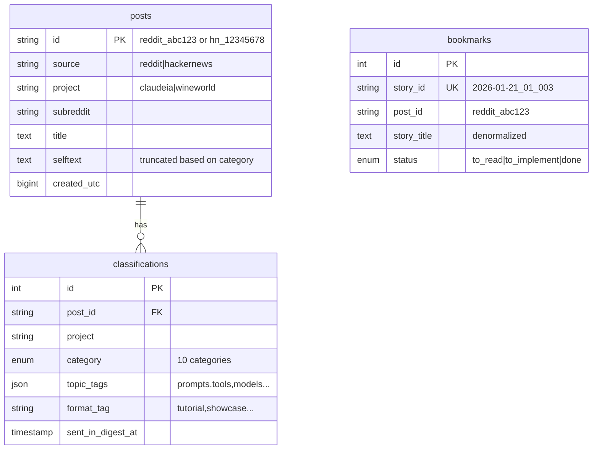

# ClaudeRedditor - Briefing for Claude

> **Purpose**: Transfer knowledge between Claude Code and Claude Web, and serve as executive summary.
>
> **Audience**: Claude AI (both instances) and developer

---

## What is this project

ClaudeRedditor is a CLI tool that analyzes posts from Reddit and HackerNews to separate useful content ("SIGNAL") from noise ("NOISE"). It uses Claude as classifier, MariaDB as cache, and generates daily newsletters in Spanish.

Main use case: monitor online communities about a specific topic (e.g., AI, wine) and generate a daily digest with the most relevant posts, filtering clickbait and unsourced claims.

---

## How it works (data flow)

```
1. INGESTION: Reddit (RSS/PRAW) + HackerNews (Firebase) → Raw posts
2. PROCESSING: Classifier (Claude Haiku) → Category + Red Flags + Topic Tags
3. STORAGE: MariaDB (posts + classifications + bookmarks)
4. OUTPUT: Digest (Markdown + JSON) → Web viewer (Astro)
```

**Flow description**:

1. **Scraping**: The system queries Reddit (via RSS or PRAW API) and HackerNews (Firebase API) looking for posts matching the project's keywords/subreddits.

2. **Cache check**: Before classifying, it checks if the post already exists in MariaDB. If it exists and has a classification for this project, it's reused (~70-80% API cost savings).

3. **Classification**: New posts are sent to Claude in batches of 20. Claude assigns one of 10 categories, detected red flags, topic_tags and format_tag. Selftext truncation happens AFTER classification: SIGNAL/META keep up to 5000 chars, NOISE/UNRELATED only 500.

4. **Digest**: SIGNAL posts not yet sent (`sent_in_digest_at IS NULL`) are processed with Claude to generate articles in Spanish. Dual output: markdown for email/reading + JSON for web viewer.

---

## Tech Stack

- **Language**: Python 3.11+
- **Main Frameworks/Libs**:
  - Typer: Modular CLI with subcommands
  - SQLAlchemy: ORM for MariaDB
  - pydantic-settings: Configuration (secrets in `.env`)
  - Rich: Formatted terminal output
- **Database**: MariaDB - Chosen for concurrency support (future web dashboard) and familiarity
- **External APIs**:
  - Anthropic (Claude): Classification and digest generation
  - Reddit: RSS (default) or PRAW (if credentials provided)
  - HackerNews: Firebase API (no auth, 500 req/min)
- **Infrastructure**: Local, automatable with cron/N8N

---

## Main CLI Commands

| Command | What it does | Usage example |
|---------|--------------|---------------|
| `scan <sub>` | Scan Reddit subreddit(s) | `scan all --project claudeia --limit 50` |
| `scan-hn` | Scan HackerNews by project keywords | `scan-hn --project claudeia --limit 30` |
| `digest` | Generate daily newsletter (markdown+JSON) | `digest --project claudeia --dry-run` |
| `bookmark add <id>` | Save story with optional notes | `bookmark add 2026-01-21_01_003 --note "Review"` |
| `bookmark list` | List bookmarks (filterable by status) | `bookmark list --status to_read` |
| `regenerate-json` | Reconstruct JSONs from DB | `regenerate-json --project claudeia --date all` |
| `init-db` | Create/migrate database schema | `init-db` |
| `config` | Show configuration and available projects | `config` |

---

## Project Structure

```
ClaudeRedditor/
├── src/claude_redditor/
│   ├── cli/              # CLI commands (Typer)
│   │   ├── scan.py       # scan, scan-hn, compare
│   │   ├── digest_cmd.py # digest
│   │   ├── bookmark.py   # bookmark show|add|list|done|status
│   │   └── db.py         # init-db, history, cache-stats, regenerate-json
│   ├── db/               # ORM and queries
│   │   ├── models.py     # RedditPost, Classification, Bookmark, ScanHistory
│   │   └── repository.py # All SQL queries
│   ├── scrapers/         # Data sources
│   │   ├── reddit.py     # RSS + PRAW
│   │   └── hackernews.py # Firebase API
│   ├── projects/         # Self-contained projects
│   │   ├── claudeia/     # config.yaml + prompts/
│   │   └── wineworld/    # config.yaml + prompts/
│   ├── classifier.py     # Classification logic (batches)
│   ├── digest.py         # Markdown + JSON generation
│   └── analyzer.py       # Metrics and smart truncation
├── outputs/              # Generated files
│   ├── digests/          # Markdown newsletters
│   └── web/              # JSON for web viewer
└── web/                  # Astro static site
```

**Key modules**:
- **cli/**: Commands isolated by responsibility. `__init__.py` aggregates them into main app.
- **projects/**: Each project is self-contained with `config.yaml` (subreddits, keywords) and `prompts/` (classify.md, digest.md). Zero code changes to add project.
- **db/repository.py**: Centralizes ALL queries. Never direct SQL in other modules.

---

## Critical Design Decisions

### Projects as self-contained entities

**Why**: Allows adding new projects (e.g., "cryptonews") without touching Python code. Just create directory with config.yaml and prompts.

**Alternatives rejected**:
- Centralized config in .env (inflexible, doesn't scale)
- Hardcode projects in code (requires deployment per change)

**Trade-off accepted**: More files to maintain per project.

---

### RSS as default for Reddit

**Why**: No API key required, sufficient for basic monitoring (50-100 posts/scan).

**Alternatives rejected**: Always require PRAW (unnecessary entry barrier).

**Trade-off accepted**: Lower volume than PRAW, but works out-of-the-box.

---

### Truncation AFTER classification

**Why**: Classification needs full context to detect red flags. NOISE storage (500 chars) doesn't justify storing everything.

**Alternatives rejected**: Truncate before (loses accuracy), store everything (unnecessary storage).

**Trade-off accepted**: Truncation logic coupled to categories.

---

### One post, multiple classifications

**Why**: Same post can be `technical` in project "wineworld" but `unrelated` in "claudeia". Classification depends on project context.

**Alternatives rejected**: One global classification per post (loses specificity).

**Trade-off accepted**: Table `classifications` has UNIQUE(post_id, project), not just post_id.

---

## Data and Models

### Main Data Model



**Relationships**:
- `posts` → `classifications`: 1:N (one post can have classification in multiple projects)
- `bookmarks` → `posts`: Soft reference via `post_id` (denormalized to avoid JOINs)

---

### Data Transformation Flow

```
Raw Post (Reddit/HN API)
  → Scraper normalizes to common dict
  → Cache check (MariaDB)
  → Classifier (Claude Haiku, batch=20)
  → Smart truncation (5000 vs 500 chars)
  → Save to DB
  → Digest query (SIGNAL + sent_in_digest_at IS NULL)
  → Claude generates Spanish article
  → Output: Markdown + JSON
```

**Formats**:
- Input: RSS XML (Reddit) / JSON (HN Firebase)
- Output: Markdown newsletter + JSON for web viewer

---

## Configuration

### Critical Environment Variables

**Required**:
- `ANTHROPIC_API_KEY`: Get at console.anthropic.com

**Optional**:
- `MYSQL_HOST`, `MYSQL_USER`, `MYSQL_PASSWORD`, `MYSQL_DATABASE`: Enables cache (highly recommended)
- `REDDIT_CLIENT_ID`, `REDDIT_CLIENT_SECRET`: Enables PRAW (faster than RSS)

### Configuration Files

- `.env`: Secrets only (API keys, passwords)
- `projects/{name}/config.yaml`: Project definition (topic, subreddits, keywords)
- `projects/{name}/prompts/classify.md`: Project-specific classification prompt
- `projects/{name}/prompts/digest.md`: Newsletter generation prompt

---

## Current State

**Version**: 1.0 (production)

**Last update**: January 2026

### Features

✅ **Implemented**:
- 9 CLI commands + 5 bookmark subcommands
- Multi-project with auto-discovery
- Reddit (RSS/PRAW) + HackerNews
- 10 categories + red flags + topic_tags
- Dual digest output (markdown + JSON)
- Bookmarks with traceability (post_id)
- Web viewer (Astro)

📋 **Known TODOs**:
- More sources (Twitter/X, newsletters)
- Real-time alerts
- Dashboard with historical metrics

---

## Typical Use Cases

### Case 1: Full daily scan

**Goal**: Scan all project sources and generate digest

**Flow**:
1. `./reddit-analyzer scan all --include-hn --project claudeia --limit 50`
2. `./reddit-analyzer digest --project claudeia`
3. Result: `outputs/digests/digest_2026-01-24.md` + `outputs/web/claudeia_2026-01-24_01.json`

---

### Case 2: Historical JSON backfill

**Goal**: Reconstruct JSONs for web viewer from existing data

**Flow**:
1. `./reddit-analyzer regenerate-json --project claudeia --date all`
2. Result: JSONs created for each date with `sent_in_digest_at`

---

### Case 3: Save story for later review

**Goal**: Bookmark an interesting story from the digest

**Flow**:
1. `./reddit-analyzer bookmark show latest` (view available stories)
2. `./reddit-analyzer bookmark add 2026-01-24_01_003 --note "Try this prompt"`
3. `./reddit-analyzer bookmark list --status to_read`

---

## Limitations and Caveats

### Known Limitations

- **No full content scraping**: External URLs are not automatically fetched (only if selftext truncated)
- **No image/video processing**: Text only
- **HackerNews limited to top 500**: Firebase API doesn't allow full-text search

### Non-intuitive Behaviors

- **Selftext of exactly 5000 chars indicates truncation**: Digest will attempt to fetch full content
- **Story IDs change if JSON is regenerated**: Sequence number may vary
- **Denormalized bookmarks**: Changes to original post are not reflected in bookmark

---

## Development Context

**Original motivation**: Automate daily filtering of r/ClaudeAI for a Spanish AI podcast, separating useful technical content from typical Reddit noise.

**Evolution**: Grew from single-subreddit to multi-project, multi-source, with web viewer.

**Current usage**:
- Frequency: Daily (cron/N8N)
- Context: "La Gaceta IA" newsletter generation for Spanish-speaking AI community

---

## Key Code Patterns

### Most Common Usage Pattern

```python
# Scan with project context
from claude_redditor.projects import ProjectLoader
loader = ProjectLoader()
project = loader.get_project("claudeia")  # Auto-discovers from projects/

# All queries go through Repository
from claude_redditor.db.repository import Repository
repo = Repository(db_connection)
posts = repo.get_unclassified_posts(project="claudeia")
```

---

### Extension Pattern: New Data Source

```python
# scrapers/new_source.py
from .base import BaseScraper

class NewSourceScraper(BaseScraper):
    def fetch_posts(self, keywords: list, limit: int) -> list[dict]:
        # Normalize to common format:
        # {id, title, author, score, url, selftext, created_utc}
        pass
```

---

## Notes for Claude Web

**Context for architecture discussions**:
- The system prioritizes simplicity over features. Each project is self-contained.
- MariaDB cache is critical for costs (70-80% savings on API).
- The 10 categories enable granular metrics, don't simplify.

**Pending decisions**:
- Embeddings for pre-filtering before Claude? (trade-off: accuracy vs cost)
- Store full content from external URLs? (trade-off: storage vs utility)

**Areas for improvement**:
- Automated testing (currently manual)
- Classification quality metrics (precision/recall)

---

## Notes for Claude Code

**Project conventions**:
- CLI commands in separate files under `cli/`
- All SQL queries in `db/repository.py`
- Project config in YAML, secrets in .env
- Output formatting with Rich (tables, panels)

**Areas requiring attention**:
- `classifier.py`: API refusal handling and category auto-correction
- `digest.py`: Sequence number logic for multiple digests per day

**When contributing**:
- Use `--project` flag consistently
- Adding new project = just create directory in `projects/`
- Don't hardcode categories, use enums from `core/enums.py`

---

## Frequently Asked Questions

### Is there a scoring system with heuristics?

**Status**: Not implemented. Currently, the system relies 100% on Claude for classification.

**Context**: There's been discussion about adding a pre-filter scoring system using heuristics (e.g., upvote ratio, author karma, comment quality) to reduce API costs by filtering obvious noise before sending to Claude. This would be a cost optimization strategy, not a replacement for Claude classification.

**Implementation consideration**: Would require:
- Define heuristic weights (score, comment count, time decay, source credibility)
- Threshold tuning (what score triggers Claude classification vs. auto-reject)
- A/B testing to validate it doesn't filter valuable content

**Current recommendation**: Wait until API costs become a real problem. Current cache hit rate (70-80%) already provides significant savings. A scoring system adds complexity and risks false negatives (missing good content).

---

### Is reading tracking implemented?

**Status**: Not implemented. No current mechanism to track which stories are actually read vs. bookmarked vs. ignored.

**Context**: The idea of tracking user engagement (clicks, reading time, bookmarks) to calibrate scoring weights or improve classification would require:
- Analytics integration in web viewer (e.g., Plausible, custom events)
- Feedback loop: user actions → weight adjustments → better filtering
- Privacy considerations (local-only tracking vs. external service)

**Implementation consideration**: Would start from scratch. Astro web viewer is currently static (no analytics), CLI doesn't track which stories the user opens.

**Current recommendation**: Add basic analytics first (which stories get clicked in web viewer) before building a full feedback loop. Could use localStorage in browser for privacy-friendly tracking.

---

### Where is the web viewer deployed?

**Status**: Currently local only. Not deployed to public hosting.

**Context**: The Astro site (`web/`) generates static files in `dist/` that could be deployed to:
- **Cloudflare Pages** (zero cost for static sites)
- **Netlify** (free tier, auto-deploy from Git)
- **Vercel** (zero config for Astro)
- **GitHub Pages** (simplest, but slower)

**Current usage**: Developer runs `npm run build` and views locally at `http://localhost:4321` or deploys manually to personal hosting.

**Deployment consideration**: Requires deciding on:
- Public vs. private (authentication needed?)
- Update frequency (rebuild on every digest? Daily cron?)
- Custom domain or subdomain

**Current recommendation**: If the newsletter is for personal use, local is sufficient. If sharing with community (e.g., "La Gaceta IA" readers), deploy to Cloudflare Pages with automatic rebuild on Git push.

---

### What's the current daily volume?

**Status**: Approximately **50-100 posts/day** across all sources (Reddit + HackerNews) for a single project.

**Breakdown by source**:
- Reddit (RSS): ~30-50 posts/subreddit when using `--limit 50`
- HackerNews: ~20-30 matching posts (keyword-based filtering)
- Cache hit rate: 70-80% (posts already classified in previous scans)

**API costs** (estimated):
- New posts per day: ~20-30 (after cache)
- Classification: 20-30 posts / 20 batch size = **~2-3 Haiku calls/day**
- Digest generation: **1 Sonnet call/day** (for SIGNAL stories)
- **Monthly cost**: ~$3-5 USD (mostly digest generation, classification is cheap)

**Cost analysis**:
- Current cache already provides 70-80% savings
- Heuristic pre-filtering would save maybe 20-30% of remaining 20-30% (marginal gain)
- Not worth the complexity unless scaling to 500+ posts/day or multiple daily scans

**Current recommendation**: No need for heuristic scoring at current volume. Focus on improving classification quality (better prompts, category refinement) rather than cost optimization. If scaling to 10x volume (500-1000 posts/day), then heuristics become attractive.

---

*Last update: January 2026*
*Generated from: main branch*
