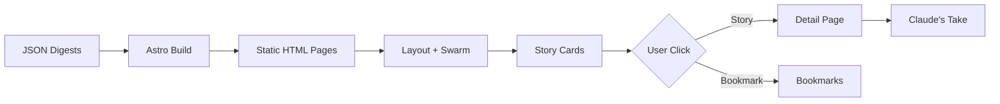

# Claude Gazette - Architecture

## The Problem

The parent ClaudeRedditor project generates AI-curated digests in markdown format, but markdown files are difficult to browse, search, and navigate. Users need a visual, interactive way to explore classified stories with context about why Claude found them interesting. The interface should reflect Claude's analytical personality and create a distinctive, futuristic aesthetic that makes content curation feel engaging rather than clinical.

## The Solution



Claude Gazette is a static site generator that transforms JSON digest files into a themed web experience. At build time, Astro reads all digest JSONs from `../outputs/web/`, generates static pages for each digest and story, applies the dark blue theme, injects the boids flocking animation, and maps Claude expressions to stories based on category and confidence. The result is a zero-backend, CDN-optimized site with personality.

## Key Decisions

### Why Static Site Generation over Dynamic Rendering?

**Context**: Digest content is generated periodically by the CLI tool and doesn't change until the next digest run.

**Options considered**:
1. **SSG (Astro)** - Pre-build all pages at build time
2. **SSR (Next.js)** - Render pages on each request with a Node server
3. **SPA (React)** - Client-side JSON fetching and rendering

**Decision**: Static Site Generation (Astro)

**Reasons**:
- Digests are immutable once generated (no live updates needed)
- Zero hosting costs (deploy to GitHub Pages, Netlify, Vercel free tier)
- Maximum performance (pre-rendered HTML, no server round trips)
- No security concerns (no backend, no database, no auth)
- Perfect for CDN distribution

**Trade-off accepted**: Must rebuild site to show new digests (acceptable for daily/on-demand update frequency)

---

### Why Canvas Animation over CSS/WebGL?

**Context**: Need subtle ambient background animation that runs smoothly without distracting from content.

**Options considered**:
1. **CSS animations** - Simple keyframes for particle movement
2. **Canvas 2D API** - Programmatic drawing with full control
3. **WebGL/Three.js** - Hardware-accelerated 3D graphics
4. **Lottie animation** - Pre-baked animation files

**Decision**: Canvas 2D API with boids flocking algorithm

**Reasons**:
- Autonomous behavior creates organic, unpredictable movement (not looped)
- Canvas 2D has universal browser support (no polyfills needed)
- ~5KB of JavaScript vs 100KB+ for Three.js
- Full control over particle appearance, speed, and behavior
- Respects `prefers-reduced-motion` accessibility setting

**Trade-off accepted**: Canvas doesn't benefit from GPU compositing like CSS transforms (minimal impact at 50 particles)

---

### Why Confidence-Based Expression Mapping?

**Context**: Stories have varying classification confidence levels; Claude should show stronger reactions to high-confidence classifications.

**Options considered**:
1. **Single expression per category** - Simple 1:1 mapping
2. **Random expressions** - Variety but meaningless
3. **Confidence-based selection** - Three expressions per category (high/medium/low confidence)
4. **Manual tagging** - Hand-pick expression for each story

**Decision**: Confidence-based expression mapping

**Reasons**:
- Reflects Claude's analytical nature (confident vs uncertain)
- Adds semantic meaning (strong skepticism vs mild doubt)
- Scalable (works for all stories without manual work)
- Three tiers (≥0.9, 0.7-0.9, <0.7) cover the confidence spectrum

**Trade-off accepted**: Requires maintaining expression mappings as categories evolve (mitigated by clear mapping in code)

---

### Why Inline SVG Icons over Icon Fonts?

**Context**: Need navigation icons (back button, bookmarks) that integrate with cyan theme.

**Options considered**:
1. **Unicode emoji** - Zero dependencies but inconsistent rendering
2. **Icon font library** (Font Awesome, Material Icons) - Extra HTTP request, harder to theme
3. **Inline SVG** - Full control but verbose HTML

**Decision**: Inline SVG with Windows-style aesthetic

**Reasons**:
- Exact color control via `currentColor` (inherits cyan from Tailwind classes)
- Scalable without quality loss
- Windows-style squares evoke nostalgic futuristic aesthetic
- No external dependencies or font loading delay
- Easy to animate with CSS transitions

**Trade-off accepted**: ~50 bytes of HTML per icon (negligible in gzipped output)

---

## Data Flow

### 1. Build Time: Page Generation

**Input**: JSON files in `../outputs/web/*.json`

**Process**:
- Astro scans directory for all JSON files (excluding `latest.json` and `bookmarks.json`)
- For each digest JSON:
  - Generate `/digest/[id]` page with story list
  - For each story in digest, generate `/story/[story_id]` detail page
- Parse `bookmarks.json` to generate `/bookmarks` page
- Apply layout with SwarmBackground component to all pages

**Output**: Static HTML files in `dist/` directory

---

### 2. Runtime: Swarm Animation Loop

**Input**: Canvas element in `<body>` (fixed position, z-index -10)

**Process**:
```
Initialize 50 Boid objects with random positions/velocities
  ↓
Animation loop (requestAnimationFrame):
  1. Clear canvas
  2. For each boid:
     - Calculate separation force (avoid crowding)
     - Calculate alignment force (match neighbors' heading)
     - Calculate cohesion force (move toward flock center)
     - Apply weighted forces to acceleration
     - Update velocity and position
     - Wrap around screen edges
     - Draw particle with radial gradient
  3. Draw connection lines between nearby boids
  4. Repeat at 60fps
```

**Output**: Smooth particle animation at <5% CPU usage

---

### 3. User Interaction: Navigation

**Input**: User clicks story card or bookmark

**Process**:
- Browser navigates to pre-rendered static page (no fetching)
- Layout includes SwarmBackground (animation continues seamlessly)
- Story page shows:
  - Claude expression (selected via `getClaudeExpression(category, confidence)`)
  - "Claude's Take" section (reasoning from classification)
  - Full article content (if available)
  - Tags and metadata

**Output**: Instant page load with persistent animation

---

## Main Components

### SwarmBackground.astro

**Responsibility**: Autonomous particle animation using boids flocking algorithm

**Inputs**: None (self-contained with CONFIG object)

**Outputs**:
- Canvas element rendering particle positions
- Particle connections (optional lines between nearby boids)

**Dependencies**: None (vanilla JavaScript)

**Key Implementation Details**:
- **Boid class**: Encapsulates position, velocity, acceleration
- **Three rules**:
  1. Separation: `separate(boids)` - steer away from crowded neighbors
  2. Alignment: `align(boids)` - match average velocity of flock
  3. Cohesion: `cohesion(boids)` - move toward flock center of mass
- **Force application**: Each rule returns a steering force vector, limited by `maxForce` constant
- **Edge handling**: Wrap around screen (toroidal topology)
- **Rendering**: Radial gradient for soft glow effect, `rgba(0, 212, 255, 0.8)` center fading to transparent

---

### Layout.astro

**Responsibility**: Site-wide structure, navigation, and theme application

**Inputs**:
- `title` prop (page title for `<head>`)
- `description` prop (optional meta description)

**Outputs**: Full HTML document with nav, footer, and content slot

**Dependencies**:
- `global.css` (dark theme styles)
- `SwarmBackground.astro` (injected into body)
- Inter font from Google Fonts

**Key Features**:
- Sticky nav bar with Claude branding
- Windows-style SVG icons for bookmarks
- Slot for page-specific content
- Footer with Claude attribution

---

### StoryCard.astro

**Responsibility**: Display story preview with Claude expression and metadata

**Inputs**:
- `story` prop (Story object from digest JSON)
- `showReasoning` prop (optional, default false)

**Outputs**: Card component with hover effects

**Dependencies**:
- `TagBadge.astro` (category, topic, format tags)
- Claude expression images (`/claude/1-12.png`)

**Key Logic**:
```javascript
const getClaudeExpression = (category: string, confidence: number): string => {
  const expressionMap = {
    'technical': [1, 12, 5],      // exuberant → happy → peaceful
    'mystical': [3, 9, 6],         // skeptical → distrustful → disappointed
    // ... 10 total categories
  };
  const expressions = expressionMap[category.toLowerCase()] || [5];
  const index = confidence >= 0.9 ? 0 : confidence >= 0.7 ? 1 : 2;
  return `/claude/${expressions[index]}.png`;
};
```

---

### TagBadge.astro

**Responsibility**: Render colored badges for categories, topics, and formats

**Inputs**:
- `tag` prop (string - tag name)
- `type` prop ('category' | 'topic' | 'format')

**Outputs**: Styled badge with semi-transparent background and colored border

**Dependencies**: Dark theme colors from `global.css`

**Color System**:
- **Categories**: Semantic colors (blue for technical, pink for mystical, etc.)
- **Topics**: Hash-based color selection (consistent per tag name)
- **Formats**: Neutral slate color

---

## Performance Considerations

### Build Performance

- **Current**: ~30 digests with ~50 stories each = ~1500 pages generated
- **Build time**: ~10-15 seconds on modern hardware
- **Bottleneck**: JSON parsing and file system operations (not a concern at current scale)
- **Optimization potential**: Could implement incremental static regeneration if build time becomes significant

---

### Runtime Performance

- **Swarm animation**: 50 boids × 60fps = 3000 calculations/second
- **CPU usage**: <5% on modern hardware (tested on 2020 MacBook Pro)
- **Memory**: ~2KB for boid objects + canvas buffer (~8KB at 1080p)
- **No layout thrashing**: Canvas draws on dedicated layer (compositor-only animation)
- **Mobile**: Tested on iPhone 12 Pro - smooth 60fps

---

### Bundle Size

- **HTML**: ~2-5KB per page (gzipped)
- **CSS**: ~10KB (shared across all pages)
- **JavaScript**:
  - Swarm animation: ~5KB
  - Astro hydration: 0KB (no client-side components)
- **Images**: 12 Claude expressions @ ~50-100KB each = ~1MB total (cacheable)
- **Total first load**: ~25KB (excluding images)

---

## Accessibility

### Motion Preferences

```css
@media (prefers-reduced-motion: reduce) {
  #swarm-bg {
    display: none;
  }
}
```

Users with vestibular disorders or motion sensitivity won't see the animation.

### Color Contrast

- **Background**: Navy #0a1929
- **Text**: Slate #e2e8f0
- **Contrast ratio**: 12.5:1 (exceeds WCAG AAA standard of 7:1)

### Keyboard Navigation

- All links and buttons accessible via Tab key
- Focus states visible with cyan outline
- Skip to content link (implicit via semantic HTML)

---

## Security

**Attack surface**: Zero

- No backend server (no server-side vulnerabilities)
- No database (no SQL injection)
- No user input (no XSS)
- No authentication (no session management)
- No external API calls (no SSRF)

**Content Security**: All content pre-validated by CLI classification step before reaching the site.

---

## Deployment

### Supported Platforms

- **Netlify**: Drop `dist/` folder or connect to Git
- **Vercel**: Zero-config Astro support
- **GitHub Pages**: Push `dist/` to `gh-pages` branch
- **Cloudflare Pages**: Connect to repo
- **Any static host**: Upload `dist/` contents

### Build Command

```bash
npm run build
# Output: dist/ directory ready for deployment
```

### Environment Variables

**None required** - fully static build with no secrets.

---

## Future Enhancements

### Potential Additions

1. **Search functionality**: Integrate Pagefind or Fuse.js for client-side search
2. **RSS feed**: Generate XML feed for story subscribers
3. **Theme toggle**: Add light mode option (toggle in localStorage)
4. **Bookmark editing**: Web UI for bookmark management (requires backend or localStorage)
5. **Story filtering**: Client-side filter by category, tag, source
6. **Analytics**: Privacy-friendly analytics (Plausible, Fathom)

### Performance Improvements

1. **Image optimization**: Convert Claude expressions to WebP format
2. **Incremental builds**: Only regenerate changed pages
3. **Service worker**: Offline support with cache-first strategy
4. **Lazy loading**: Load story details on demand (currently static pre-render)

---

## Testing Strategy

### Build Testing

```bash
npm run build              # Verify build succeeds
npm run preview            # Test production build locally
open http://localhost:4321 # Manual visual testing
```

### Visual Regression

- Test on Chrome, Firefox, Safari
- Verify swarm animation smoothness
- Check expression mapping correctness
- Validate dark theme colors

### Accessibility Testing

- Run Lighthouse audit (target 100 accessibility score)
- Test with keyboard navigation only
- Verify screen reader compatibility (NVDA, JAWS)
- Test with `prefers-reduced-motion` enabled

---

*Last updated: January 2026*
